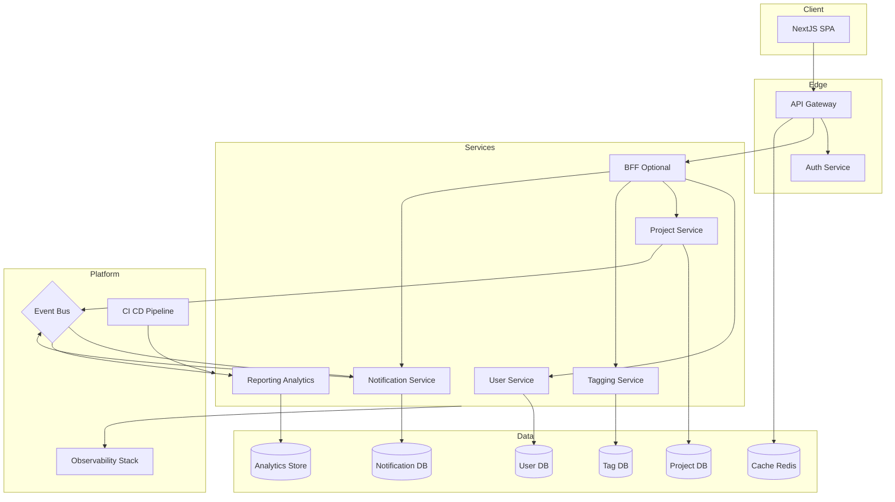

# High-Level Architecture

## 1. Overview

This document describes the target architecture for the Roo Code Project Management Application. The solution emphasizes scalability, maintainability, and clear ownership boundaries across business capabilities while remaining practical for staged delivery.

## 2. Architectural Strategy

A **microservices-oriented** architecture is the long-term target to support independent delivery, resilience, and domain-driven ownership. Client interactions are mediated through an API Gateway that centralizes edge concerns and forwards requests to scoped backend services.

### 2.1 Phased adoption roadmap

- **Baseline (Modular Monolith):** Start with a modular monolith using bounded contexts that mirror the target services (User, Project, Notifications, Tagging). Enforce module boundaries through internal interfaces and shared libraries.
- **Decomposition triggers:** Graduate a module into an independently deployable service when one or more triggers are met: team autonomy required, scaling or performance hotspots, differentiated release cadence, or regulatory isolation needs.
- **Service maturity checklist:** Before extraction ensure domain boundaries are well documented, contracts and API schemas are stable, observability and deployment pipelines exist, and data ownership is clearly assigned.

### 2.2 Communication style

- **Synchronous:** RESTful APIs via the gateway for query and command interactions that require immediate feedback.
- **Asynchronous:** Event-driven messaging for cross-service workflows, leveraging an event bus for eventual consistency and decoupled processing.

## 3. Core Components

- **Web Client (Next.js SPA):** Provides the primary user interface, consuming REST and real-time endpoints. Leverages the Backend-for-Frontend (BFF) when present for optimized compositions.
- **API Gateway (Hono):** Single ingress handling TLS termination, request routing, authentication enforcement, rate limiting, and API lifecycle management.
- **Auth Service:** Authority for identity, authentication (email/password, future SSO), session/token issuance, and role-based access control policies.
- **Backend-for-Frontend (optional):** Tailors composite APIs for specific client experiences, reducing chatty interactions and shielding client changes from service contracts.
- **User Service:** Owns user profiles, role assignments, and preference management; integrates with Auth Service for authorization decisions.
- **Project Service:** Manages projects, tasks, comments, and lifecycle workflows; publishes domain events consumed by other services.
- **Tagging Service:** Provides tag catalog management, assignment, and filtering functions; maintains referential integrity with Project Service entities.
- **Notification Service:** Generates in-app and email notifications based on subscribed events and user preferences.
- **Reporting and Analytics Service:** Aggregates operational data into analytical views and dashboards, sourcing data from the event stream and read replicas.
- **Event Bus:** RabbitMQ or Kafka cluster used for domain events, integration events, and background job dispatch.
- **Observability Stack:** Centralized monitoring (metrics, logs, traces) consumed by the platform and product teams.

## 4. Cross-Cutting Concerns

- **Identity federation:** Support for OAuth/OIDC providers and SSO is brokered through the Auth Service and enforced at the gateway.
- **Secrets and configuration management:** Environment-specific secrets stored in Vault or AWS Parameter Store; configuration served through centralized config service or environment variables with validation.
- **Caching:** Redis used for session tokens, rate limiting counters, and read-heavy aggregates.
- **Observability:** OpenTelemetry instrumentation exporting to Prometheus, Grafana, and distributed tracing solutions such as Jaeger or Tempo. Alerting pipelines defined for SLO breaches.
- **API governance:** Versioning, schema validation, and contract testing enforced for public APIs and event schemas.
- **Security:** Standardized approach to TLS, service-to-service authentication (mTLS), static/dynamic code analysis, and vulnerability scanning.

## 5. Data Storage and Tenancy

- **Per-service databases:** Each service maintains its own PostgreSQL schema to preserve autonomy and avoid accidental coupling.
- **Tenancy model:** Default to single-tenant per workspace with organization_id scoping; evaluate full multi-tenant partitioning once customer count warrants. Sensitive services (Auth, User) may retain separate deployments.
- **Backup and recovery:** Nightly encrypted backups with point-in-time recovery targets for production; quarterly disaster recovery drills validating restore procedures.
- **Data contracts:** Shared events and read models versioned through a schema registry; backward-compatible changes mandated. Breaking changes require migration plans and consumer readiness sign-off.
- **Analytics store:** Columnar warehouse (e.g., ClickHouse or BigQuery) populated via event streaming for reporting use cases.

## 6. Eventing and Integration

Event-driven workflows ensure loose coupling and extensibility. Events are published to dedicated topics or exchanges with retry and dead-letter routing.

| Event | Producer | Consumers | Notes |
| :----- | :------- | :-------- | :---- |
| TaskAssigned | Project Service | Notification Service, Reporting | Fan-out notification and analytics updates |
| TaskStatusChanged | Project Service | Reporting, Tagging | Drives dashboards and potential automation |
| CommentAdded | Project Service | Notification Service | Triggers mention-based alerts |
| NotificationDelivered | Notification Service | Reporting | Tracks delivery metrics and user preferences |

- **Transport:** Use RabbitMQ for simpler routing (topic or direct exchanges) or Kafka for high-throughput streams; standardize serialization on JSON Schema or Avro.
- **Error handling:** Configure exponential backoff retries, dead-letter queues or topics, and alerting on sustained failures.
- **Contract validation:** Employ schema registry and consumer-driven contract tests to prevent breaking downstream consumers.

## 7. Deployment and Platform Architecture

- **Containerization:** Docker images built per service with multi-stage builds and security scanning.
- **Orchestration:** Kubernetes (self-managed or managed service) providing service discovery, auto-scaling, and rollout strategies such as blue/green and canary.
- **CI/CD:** Pipeline stages for linting, unit and integration tests, security scanning, artifact build, infrastructure as code deployment, and automated smoke tests.
- **Environment strategy:** Dedicated dev, staging, and production clusters with configuration parity; feature flags used to manage gradual rollouts.
- **Secrets storage:** External secret management (Vault, AWS Secrets Manager, or GCP Secret Manager) integrated with workload identities.
- **Infrastructure observability:** Platform telemetry (cluster health, cost monitoring) fed into the observability stack.

## 8. Technology Stack (Recommended)

| Layer | Technology | Notes |
| :---- | :--------- | :---- |
| Frontend | Next.js 16, TypeScript | SPA with SSR or ISR as needed, communicates via BFF when available |
| API Gateway | Hono (Edge Runtime) or Kong | Lightweight edge layer with authentication, rate limiting, routing |
| Backend Services | NestJS (Node.js 20) | Domain-driven services with dependency injection and CQRS patterns |
| Data Stores | PostgreSQL, ClickHouse (analytics) | Transactional workloads per service; analytical workloads centralized |
| Messaging | RabbitMQ or Apache Kafka | Domain and integration events, background processing |
| Caching | Redis | Session storage, caching, rate limiting |
| Observability | OpenTelemetry, Prometheus, Grafana, Loki | Unified metrics, logs, traces, and alerting |
| Infrastructure as Code | Terraform or Pulumi | Declarative environment provisioning |

## 9. System Architecture Diagram

## 10. Key Considerations

- Align service boundaries with business-capability ownership to reduce coordination overhead.
- Invest early in automated testing, contract validation, and observability to maintain delivery velocity as services scale.
- Revisit the architecture roadmap quarterly to incorporate feedback from delivery teams and operational metrics.
